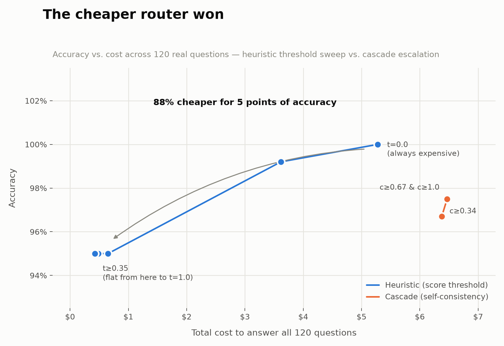

# Cascade Router

A complexity-based LLM router: a Lambda service that scores incoming prompts
for difficulty and routes each one to the cheapest model tier likely to
answer it correctly, escalating to a stronger model when needed. Built as a
phased project — starting from a simple heuristic scorer and ending with a
confidence-based cascade — with an eval harness that plots accuracy-vs-cost to
justify each routing decision with data rather than intuition.

## Architecture (target end state)

- **Entry point:** API Gateway → Lambda (Python)
- **Router:** starts as heuristic (Phase 1), evolves into a cascade with
  confidence-based escalation (Phase 5)
- **Storage:** DynamoDB — request/routing/cost logs, designed around a
  partition key that avoids hot partitions at scale (not `model_name` or
  `date` alone)
- **Eval:** a small labeled eval set + harness that plots an accuracy-vs-cost
  Pareto curve, used to justify routing thresholds with actual data
- **Two model tiers:** one cheap/fast model, one expensive/strong model

## Getting started

```bash
cp .env.example .env   # fill in ANTHROPIC_API_KEY
sam build
sam deploy --guided
```

Prod secrets live in SSM Parameter Store, not env vars — see the comment in
`.env.example`.

### Running tests

```bash
pip install -r requirements-dev.txt
python -m unittest discover -s tests
```

## Eval results: heuristic vs. cascade



Real data from `eval/plot_pareto.py` — all 120 questions, real Anthropic API
calls, real LLM-judge grading. Not intuition.

**Heuristic router (score threshold):**

| Threshold | Accuracy | Total cost |
|---|---|---|
| 0.00 (always expensive) | 100.0% | $5.2791 |
| 0.20 | 99.2% | $3.6162 |
| 0.35 | 95.0% | $0.6521 |
| 0.50 (current default) | 95.0% | $0.6521 |
| 0.65 | 95.0% | $0.4864 |
| 0.80 | 95.0% | $0.4265 |
| 1.00 (always cheap) | 95.0% | $0.4265 |

**Cascade router (self-consistency confidence threshold, n=3 samples):**

| Confidence ≥ | Accuracy | Total cost |
|---|---|---|
| 0.34 (escalate unless any 2 of 3 agree) | 96.7% | $6.3760 |
| 0.67 (escalate unless majority agree) | 97.5% | $6.4686 |
| 1.00 (escalate unless unanimous) | 97.5% | $6.4686 |

**The cascade loses.** It's dominated by the heuristic on both axes: every
cascade point costs *more* than even the always-expensive heuristic
baseline ($6.38–$6.47 vs. $5.28), while topping out at 97.5% accuracy versus
the heuristic's 100%. The 0.67 and 1.00 thresholds land on identical
numbers — with only 3 samples, confidence can only be 1/3, 2/3, or 1.0, and
both thresholds end up escalating everything except the unanimous cases.

**Why:** self-consistency here means sampling the cheap model 3 times and
checking whether the responses match after light text normalization. For
**96 of 120 questions (80%)**, no two of the three samples matched at all —
even for questions the cheap model reliably *answers correctly*, the
phrasing varies enough across samples that exact-text agreement almost
never happens on open-ended prose. So the confidence signal reads "low" for
the vast majority of questions regardless of actual difficulty, the router
escalates almost everything, and the cascade ends up paying for 3 cheap
calls *and* an expensive call on top, worse than just calling the expensive
model directly. Exact-match self-consistency is the wrong confidence signal
for free-form answers — it would need semantic similarity, a
short/structured probe question, or fewer, cheaper samples to be worth
running at all.

**Heuristic threshold reading:** cost drops ~91% (from $5.28 to $0.43-0.65)
moving from always-expensive to threshold 0.35+, for a 5-point accuracy
loss (100% → 95%). Almost all the savings are captured by threshold
≈0.2–0.35; pushing the threshold higher barely changes cost further,
because few questions in this set score above ~0.35 on the heuristic, so
most routing decisions are already locked in by that point. The current
default of **0.5 sits on that flat part of the curve** — full cost benefit
without giving up accuracy over the 0.35–1.0 range, though 0.2 buys back
4.2 accuracy points for roughly 6x the cost.

**Bottom line:** for this dataset, a crude heuristic score threshold beats
a self-consistency cascade outright — cheaper *and* more accurate. The
cascade's core idea (only pay for the expensive model when you need to) is
sound, but the confidence signal implementing it here is too blunt for
free-form text. A better cascade would need a confidence measure that
tolerates paraphrasing.

## Roadmap

| Phase | Scope | Definition of done |
|---|---|---|
| 0 | Scaffolding — IaC stack, config management, least-privilege IAM | `sam deploy` succeeds with an empty/no-op Lambda |
| 1 | Baseline heuristic router — regex/token-count scorer, routes to one of two real models | Deployed endpoint routes real requests based on a heuristic score and explains why |
| 2 | DynamoDB logging, designed against hot partitions | Every routed request is logged with an explainable trail; a script proves the partition key holds up under concurrent load |
| 3 | Cost tracking — real tokenizers, pricing table, cost reports | `python cost_report.py --since <date>` prints real measured spend by tier |
| 4 | Eval harness + labeled dataset | A plotted accuracy-vs-cost Pareto curve backs the threshold choice |
| 5 | Cascade routing — cheap model first, escalate on low confidence | Two comparable Pareto curves (heuristic / cascade) with a tradeoffs write-up |
| 6 | README rewrite | A stranger can clone the repo and understand the system from the README alone |
