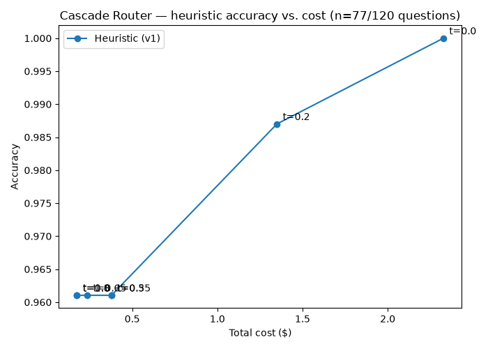

# Cascade Router

A complexity-based LLM router: a Lambda service that scores incoming prompts
for difficulty and routes each one to the cheapest model tier likely to
answer it correctly, escalating to a stronger model when needed. Built as a
phased project — starting from a simple heuristic scorer and ending with a
confidence-based cascade — with an eval harness that plots accuracy-vs-cost to
justify each routing decision with data rather than intuition.

## Architecture (target end state)

- **Entry point:** API Gateway → Lambda (Python)
- **Router:** starts as heuristic (Phase 1), evolves into a cascade with
  confidence-based escalation (Phase 5)
- **Storage:** DynamoDB — request/routing/cost logs, designed around a
  partition key that avoids hot partitions at scale (not `model_name` or
  `date` alone)
- **Eval:** a small labeled eval set + harness that plots an accuracy-vs-cost
  Pareto curve, used to justify routing thresholds with actual data
- **Two model tiers:** one cheap/fast model, one expensive/strong model

## Getting started

```bash
cp .env.example .env   # fill in ANTHROPIC_API_KEY
sam build
sam deploy --guided
```

Prod secrets live in SSM Parameter Store, not env vars — see the comment in
`.env.example`.

### Running tests

```bash
pip install -r requirements-dev.txt
python -m unittest discover -s tests
```

## Eval results: heuristic threshold vs. cost



Real data from `eval/plot_pareto.py`, sweeping the heuristic score threshold
against real Anthropic API calls and LLM-judge grading — not intuition.

| Threshold | Accuracy | Total cost |
|---|---|---|
| 0.00 (always expensive) | 100.0% | $2.3269 |
| 0.20 | 98.7% | $1.3497 |
| 0.35 | 96.1% | $0.3782 |
| 0.50 (current default) | 96.1% | $0.3782 |
| 0.65 | 96.1% | $0.2355 |
| 0.80 | 96.1% | $0.1756 |
| 1.00 (always cheap) | 96.1% | $0.1756 |

**Reading it:** cost drops ~92% (from $2.33 to $0.18) moving from
always-expensive to threshold 0.35+, for a 3.9-point accuracy loss (100% →
96.1%). Almost all the savings are captured by threshold ≈0.2–0.35; pushing
the threshold higher barely changes cost further, because few questions in
this set score above ~0.35 on the heuristic, so most routing decisions are
already locked in by that point. The current default of **0.5 sits right on
that flat part of the curve** — it gets the full cost benefit without giving
up any accuracy over the 0.35–1.0 range, though 0.2 would buy back 2.6
accuracy points for roughly 4x the cost. There's no cascade-router curve to
compare against yet (see caveat below), so this can't say whether
self-consistency escalation would beat the heuristic on cost at the same
accuracy — that's the open question the next run needs to answer.

**Caveat — this is partial data.** The full eval run (120 questions ×
heuristic + cascade sweeps) hit an Anthropic API credit limit partway
through. What's plotted above is the heuristic-only curve computed from the
77 of 120 questions that had both tiers fully evaluated before the run
stopped; the cascade curve has no data yet. Re-run
`python eval/plot_pareto.py` after topping up API credits — it resumes from
`eval/tier_results.json` / `eval/cascade_results.json` rather than
re-paying for what's already cached — to fill in the remaining 43 questions
and the full cascade comparison.

## Roadmap

| Phase | Scope | Definition of done |
|---|---|---|
| 0 | Scaffolding — IaC stack, config management, least-privilege IAM | `sam deploy` succeeds with an empty/no-op Lambda |
| 1 | Baseline heuristic router — regex/token-count scorer, routes to one of two real models | Deployed endpoint routes real requests based on a heuristic score and explains why |
| 2 | DynamoDB logging, designed against hot partitions | Every routed request is logged with an explainable trail; a script proves the partition key holds up under concurrent load |
| 3 | Cost tracking — real tokenizers, pricing table, cost reports | `python cost_report.py --since <date>` prints real measured spend by tier |
| 4 | Eval harness + labeled dataset | A plotted accuracy-vs-cost Pareto curve backs the threshold choice |
| 5 | Cascade routing — cheap model first, escalate on low confidence | Two comparable Pareto curves (heuristic / cascade) with a tradeoffs write-up |
| 6 | README rewrite | A stranger can clone the repo and understand the system from the README alone |
